# Blog Posts API — Spring Boot and MongoDB

[](https://openjdk.org/projects/jdk/17/)
[](https://spring.io/projects/spring-boot)
[](https://www.mongodb.com/)
[](LICENSE)

A REST API for a small blog: users, the posts they write, and the comments on each post. The search endpoints look through titles, bodies and comments.

Built while following the Udemy course *"COMPLETE Java 2023 Object-Oriented Programming + Projects"*, by Nélio Alves. It is my third Spring Boot application and the first with a **NoSQL** database, which is the point of the project: the same kind of domain modelled as documents rather than tables.

## Tech stack

- **Java 17**
- **Spring Boot 3.1.3** — Spring Web and Spring Data MongoDB
- **MongoDB**
- **Maven**, through the Maven Wrapper (`./mvnw`)

## Document model

<p align="center"><a href="docs/document-model.svg"></a></p>

Only **`User`** and **`Post`** are collections. Everything in gray is stored *inside* a post document:

- **Comments are embedded**, not a collection of their own. A post carries its `CommentDTO` list, so reading a post takes one query and no join.
- **The author is embedded too**, as an `AuthorDTO` that copies only the id and the name of the user. It is a deliberate duplication: it saves a lookup, at the cost of a stale name if the user renames themselves.
- **`User` also keeps a list of its posts**, so the reference exists on both sides.

That trade — duplicate data to avoid joins — is the difference from a relational schema, where the comment would be a table with a foreign key.

## Endpoints

| Method | Path | Description |
|---|---|---|
| `GET` | `/users` | All users |
| `GET` | `/users/{id}` | One user |
| `POST` | `/users` | Creates a user, returns 201 with its URI |
| `PUT` | `/users/{id}` | Updates name and email |
| `DELETE` | `/users/{id}` | Deletes a user |
| `GET` | `/users/{id}/posts` | The posts of a user |
| `GET` | `/posts/{id}` | One post, with its comments |
| `GET` | `/posts/titlesearch?text=` | Posts whose **title** matches, case-insensitive |
| `GET` | `/posts/fullsearch?text=&minDate=&maxDate=` | Posts whose title, body **or comments** match, within a date range |

Dates are `yyyy-MM-dd` in GMT. `minDate` defaults to the epoch and `maxDate` to now, so both are optional:

```bash
curl "http://localhost:8080/posts/fullsearch?text=viagem&minDate=2018-01-01&maxDate=2018-12-31"
```

An unknown id raises `ObjectNotFoundException`, which a `@ControllerAdvice` turns into **404** with a `StandardError` body — timestamp, status, error, message and path.

## Running locally

Requirements: **Java 17** and a **MongoDB** on `localhost:27017`. Maven does not need to be installed.

```bash
docker run -d --name blog-mongo -p 27017:27017 mongo:7
```

```bash
git clone https://github.com/nathan00pdl/spring-boot-mongodb-blog-api.git
cd spring-boot-mongodb-blog-api
./mvnw spring-boot:run
```

The API starts on `http://localhost:8080` against the `workshop_mongo` database, configured in `src/main/resources/application.properties`.

> **Careful:** `Instantiation` runs at every startup and calls `deleteAll()` on both collections before inserting the sample data — 3 users (Maria Brown, Alex Green, Bob Grey) and 2 posts with their comments. Anything you create through the API is gone on the next restart.

## Diagrams

Click a diagram to open it at full size. The diagram is generated from the Mermaid source in `docs/`, so it stays editable text rather than binary images:

```bash
for d in docs/*.mmd; do
  npx @mermaid-js/mermaid-cli -i "$d" -o "${d%.mmd}.svg" -t default -b white -c docs/mermaid-config.json
  python3 docs/finish-svg.py "${d%.mmd}.svg"
done
```

`finish-svg.py` adds a margin around each diagram and gives the arrow labels an opaque background, so the SVG looks the same in any viewer.

## License

Licensed under the [MIT License](LICENSE).

## Contact

Nathan Paiva de Lacerda — [LinkedIn](https://www.linkedin.com/in/nathan-paiva-636336236)
